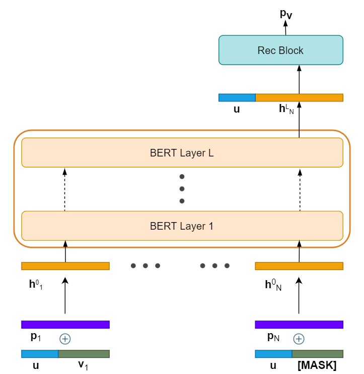
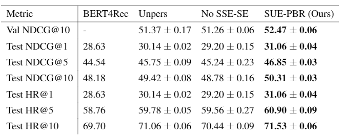
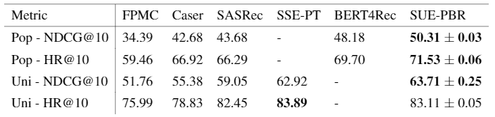

# Abstract
This repository presents a state-of-the-art, personalised bidirectional recommendation system evaluated with a new data splitting technique. We show that user embeddings provide true personalisation by learning the latent preferences of users from their past actions. Interestingly, this information affects the recommendation process in various ways. For instance, incorporating user embeddings causes severe generalisation issues, making shared embedding regularisation a necessity. Furthermore, the user embeddings also affect model behaviour, causing it to assign a higher weighting to more recent user actions.

Based on the following work
> **BERT4Rec: Sequential Recommendation with BERT (Sun et al.)**  

> **SSE-PT: Sequential Recommendation Via Personalized Transformer (Wu et al.)** 

# Methodology
We incorporate user embeddings in both the embedding and recommendation blocks to encourage the model to learn user preferences. To avoid overfitting, we also regularise them using SSE-SE shared embedding regularisation.

Architecture:

# Recommendation Results
To analyse the effects of personalisation, we prepared two baseline architectures. The first is the unpersonalised bidirectional architecture from BERT4Rec (_Unpers_). Essentially this is the same as our architecture, but without user embeddings and added regularisation. This will help us gauge the improvements that regularised personalisation adds to bidirectional architectures. For greater flexibility in isolating solely the performance increase due to SSE-SE, we also included a second baseline: our personalised architecture, but regularised solely with L2 regularisation and dropout (_No SSE-SE_).
Both baselines were evaluated with MovieLens-1M on 100 negative items samples by popularity (_Pop_).

To compare against other models, we used the results reported in other papers. For fairness and consistency, we first had to also evaluate our model on negative items sampled uniformly.

